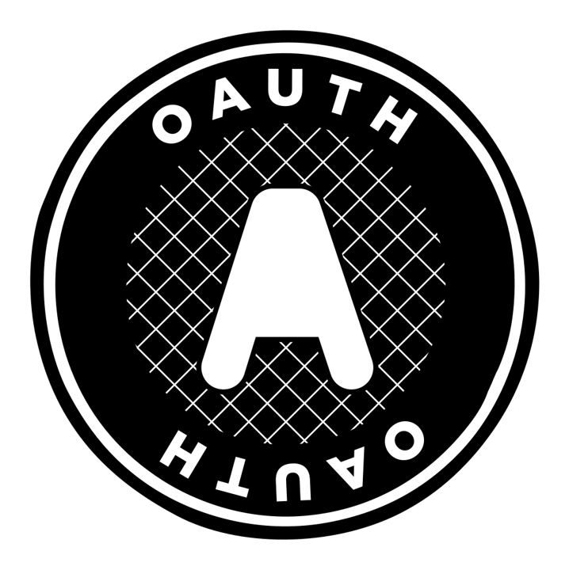

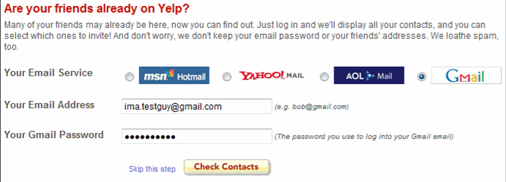

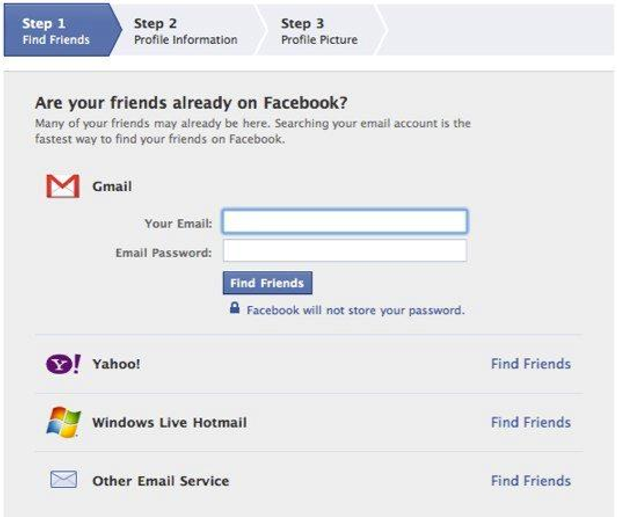

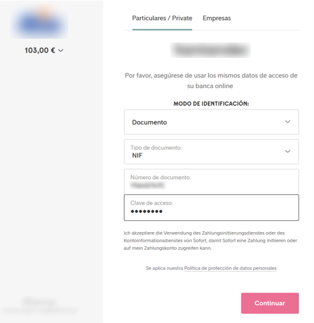

# Autorización, Tokens, Flujos, oAuth y OIDC para todo el mundo

# Leonardo Micheloni

@leomicheloni

## Escenario

Existen muchos escenarios en los que necesitamos acceder a un recurso de un tercero desde nuestra aplicación.
Por ejemplo si estamos desarrollando una aplicación para gestionar la cuenta de Twitter de los usuarios necesitaremos acceso a la información de su cuenta, su timeline y hasta permisos para publicar en su nombre.
 También podemos tener la necesidad de crear una aplicación que simplemente busque los TT en Twitter y haga algo con eso.
 Otro ejemplo podría ser necesitar acceder a la información de Google maps, un conjunto de recursos de una plataforma de terceros, etc.
 O acceder los contactos de Gmail de una persona para invitarlos a participar de nuestra propia plataforma.

 En el pasado ha habido métodos para lograr esto los cuales han llegado a ser incluso proveer nuestro usuario y password de Gmail para que Yelp acceda a nuestra cuenta y recupere la información de nuestros contactos.

 ## Necesidad

Sería bueno encontrar un método para otorgar acceso a algún recurso propio a un tercero sin necesidad de otorgar nuestras credenciales.
Ya que, métodos de este como al anterior, no solo que comprometen nuestras credenciales sino que también dan acceso a todos los recusos que tenemos acceso, el tiempo que se otorga este acceso a ilimitado, la aplicación no sabe del tercero y, además, finalmente quien obtenga en acceso a fines prácticos actúa como si fuera nosotros mismos ya que tiene las credenciales.

El escenario ideal sería:
 - Otorgar acceso sin exponer nuestras credenciales
 - Que este acceso sea limitado a un grupo de recursos
 - Que el tiempo de duración de este acceso sea limitado
 - Que en caso de comprometerse ese método de acceso el daño sea el menor posible
 - Que la aplicación sepa acerca de este tercero que solicita acceso
 
 ## oAuth

 ### Introducción
 Es un protocolo standard de autorización que se encuentra muy extendido, principalmente su versión 2.0.
 

### Autorización vs autenticación
Autorización es la capacidad de acceder a un recurso, estar autorizado para acceder, es equivalente a poseer una entrada para un recital, no importa quién soy ni como la obtuve, si se comprueba que la entrada es válida y para el recitarl correcto, en la fecha, hora y lugar correctos el solo hecho de poseer esta entrada me permite obtener acceso, me autoriza.

Autenticación es la capacidad de verificar la identidad el sujeto, por ejemplo por medio de un pasaporte, en él figuran mis datos y se puede verificar quién soy ya que el documento indica datos propios.

> oAuth es un protocolo de autorización.

## Autorización
--- 


## Autenticación
---


---

## Terminología

Para el mismo caso de Yelp queriendo acceder a nuestros contactos de Gmail vamos a cambiar un poco la terminología para que sea más parecida a la que utiliza oAuth


- Tiene acceso a todos mis recursos
- Por tiempo indefinido
- De hecho, para Yahoo es yo mismo

### Escenario deseado:

 - Otorgar acceso sin exponer nuestras credenciales
 - Que este acceso sea limitado a un grupo de recursos
 - Que el tiempo de duración de este acceso sea limitado
 - Que en caso de comprometerse ese método de acceso el daño sea el menor posible

---


---


---
## Client credentiales authorization flow

Esto es uno de los "flujos" o "grants" que oAuth ofrece para autorización.

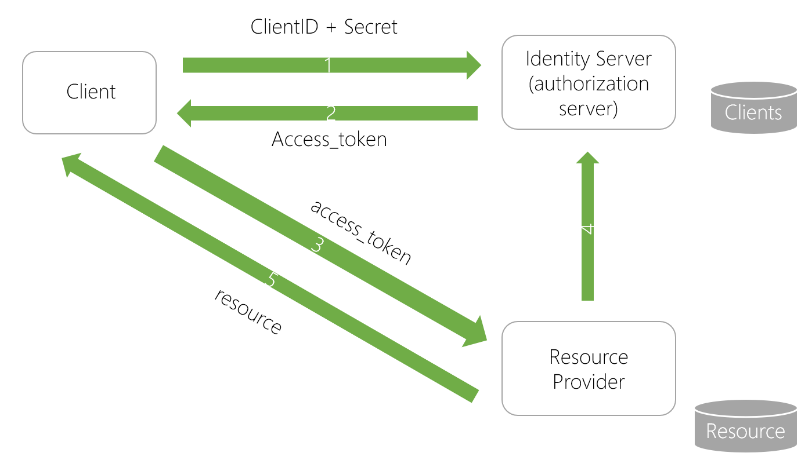

> Un ejemplo podría ser Google, el mismo servidor de autorización se utiliza para diferentes servicios como Maps, Email, Drive, etc.

### En resumen
 - Authorization server: quien otorga tokens y conoce a todos los clientes y recursos
 - Scope: Recurso, conjunto de recursos, o nivel de acceso.
 - Client: La aplicación que necesita un token para acceder a un recurso
 - Resource server: el servidor que posee el recurso, debe conocer al Authorization server (no conoce al cliente)
 - Token: elemento de información que provee acceso (Acceess Token) tiene scope, vencimiento e issuer.
 - La solicitud del token se realiza sin intervención del usuario y por backchannel

(por eso el año pasado cuando cayó el servicio de autenticación de google dejó de funcionar todo)


## ¿Y Qué es un Token?

Es un trozo de información, en nuestro caso vamos a utilizar un formato conocido como JSON Web token o JWT

### JWT

- En un conjunto de información
- Es otorgado por el Auth Server
- Tiene 3 bloques: Header, Payload y Signature
- Tiene un periodo de validez
- Indica los accesos (scopes)
- Pueden ser Self encoded
- Puede incluir un código para refrescar el vencimiento con un nuevo token (Refresh token es también un scope offline_access)
- Es firmado con clave asimétrica


## ¿Y qué es un grant o flow?

Es el flujo de intercambios de mensajes entre el Authorization Server y el Client para obtener un Access Token

- Es también un scope
- Client Credentials: Para robots (backchannel)
- Implicit: Con redirección, interactivo (front channel)
- Code / Code + PKCE (front y backchannel)
- Resource owner (frontchannel)
- Device (frontchannel)
- Hybrid


## Client Credentials grant

- Solo para robots (el usuario no interviene)
- **Solo por backchannel** (el secret queda expuesto)
- Muy común para acceso entre APIs 
- Es conveniente utilizar solo los scopes necesarios
- Es ideal que la duración del token sea mínima
- Soporta refresh


>      ---

## Ejemplo client credential ##

>      ---

## Refresh token

Es ideal que el token tenga una duración lo más breve posible, en lugar en pedir un nuevo token cada vez que se vence el anterior podemos solicitar junto con el primer **access_token** un token que nos permita refrescar (obtener otro access_token con los mismos datos) que se llama **refresh_token**
- El refresh token se solicita utilizando un socpe **offline_access*
- El refresh token sí es persistido en el Authorization server
- Esto nos permite, junto con una duración corta del access_token, que al invalidar los refresh token existentes podamos revocar el acceso
- Para solitar un nuevo token utilizaremos el refresh_token, el secret, el client_id y el grant refresh_token

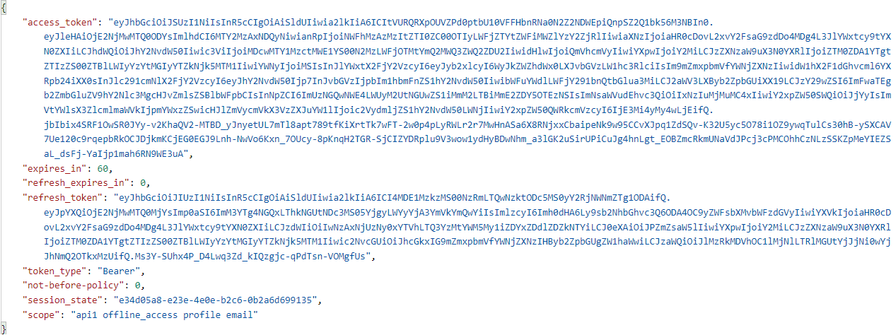

## Flujos con participación del usuario (front channel)


---


Esto también es trasladable a nuestra aplicación.

---

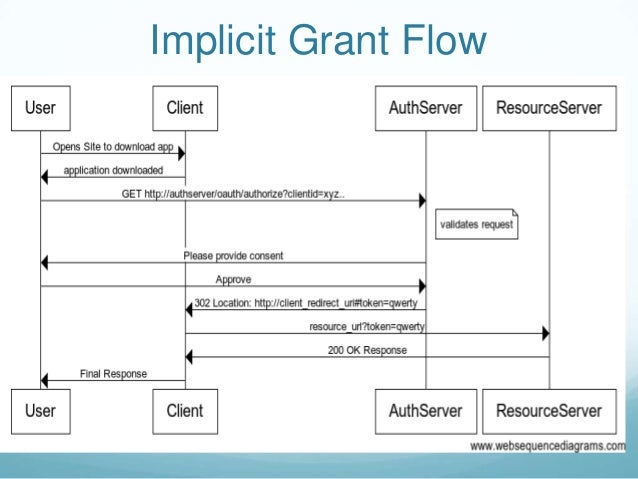


### Características de implicit flow

- Es interactivo
- Se realiza por frontchannel
- El callbackURL es un dato clave


### Desventajas

- Solo para SPA (y si no tienen back)
- El token queda almacenado en el client
- El token no se puede refrescar
- No es recomendable

>      ---

## Ejemplo Implicit ##

>      ---


## Solicionando los problemas de Implicit Flow (Authorization Code Flow grant)


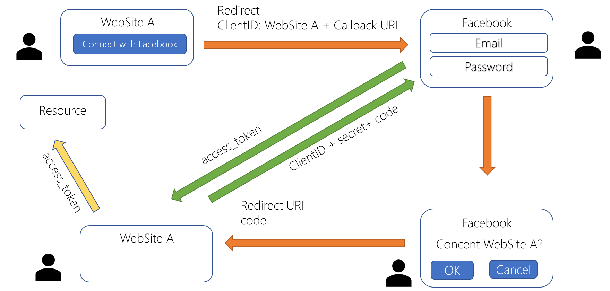

## Authorization code flow

- Necesitamos sí o sí de un backchannel (backend)
- Permite refresco 
- Podemos solicitar un token de corta duración ya que es posible refrescar
- Es más complejo
- Es el método recomendado

### Funcionamiento

- El authorization server nos entrega un código de uso único
- De tiempo limitado
- Solo para el cliente que lo solicitó
- Solo para los scopes solicitados
- Con eso code solicito el access_token 
- Puedo hacer refresh a partir de ahí desde backchannel


## Perfeccionando Code flow con PKCE

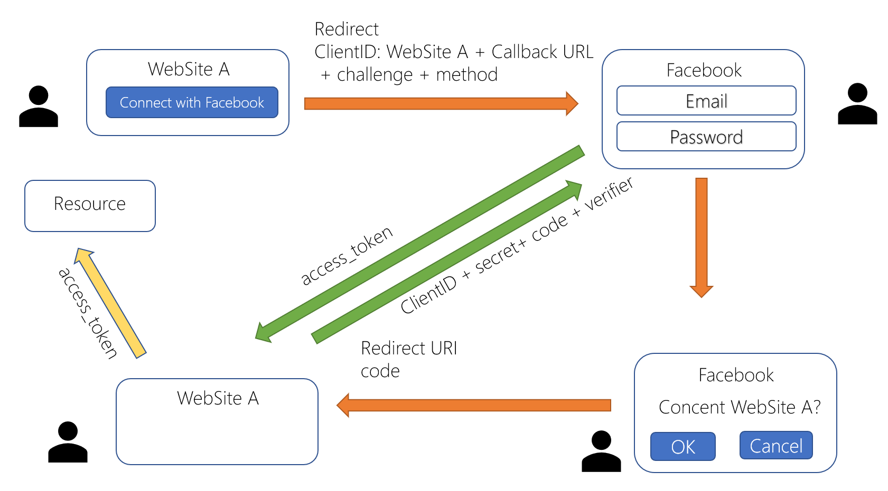

 - Es una extensión de code
 - Se agrega un "challenge" al solicitar el código (un código aleatorio)
 - El código de retorno está tratado con un algorítmo (+ un seed o clave) acordado en el challenge (texto plano o sha256)
 - No es posible utilizar el código sin sabe el dato inicial
 - Éste es el método más recomendado hoy en día para este tipo de escenarios


``` javascript
code_challenge = base64urlEncode(SHA256(ASCII(code_verifier)))
```

# ¿Y qué hay de la autenticación?

 
## OIDC


- OpendID Connect es un protocolo desarrollado sobre oAuth2 que provee capacidades de autenticación y varias utilidades.
- Lo más común es que se confundan / intercambien los nombres OIDC / oAuth ya que uno depende del otro y hoy en día es raro ver que un sistema utilice oAuth y no OIDC.

### Discovery endpoint

- /.well-know/openid-configuration
- Retorna la información sobre el resto de endpoints
- Datos como scopes soportados
- Agregar scope open_id, profile, email
- Agrega un nuevo token **id_token**
- La información extra se recibe como claims en el nuevo token
- Se define un endpoint para información del usuario (userinfo endpoint)
- Aparece el concent ya que compartimos datos

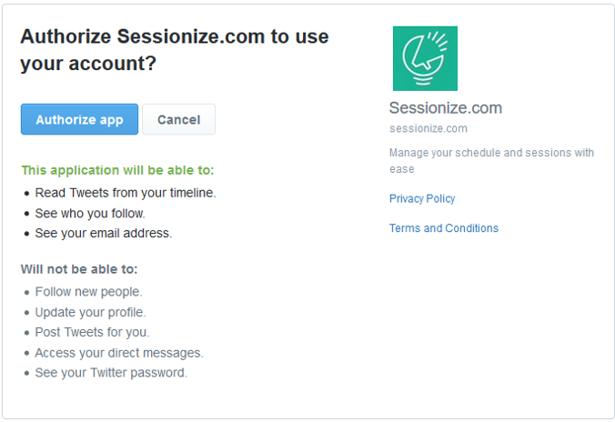


(ejemplo de id token)

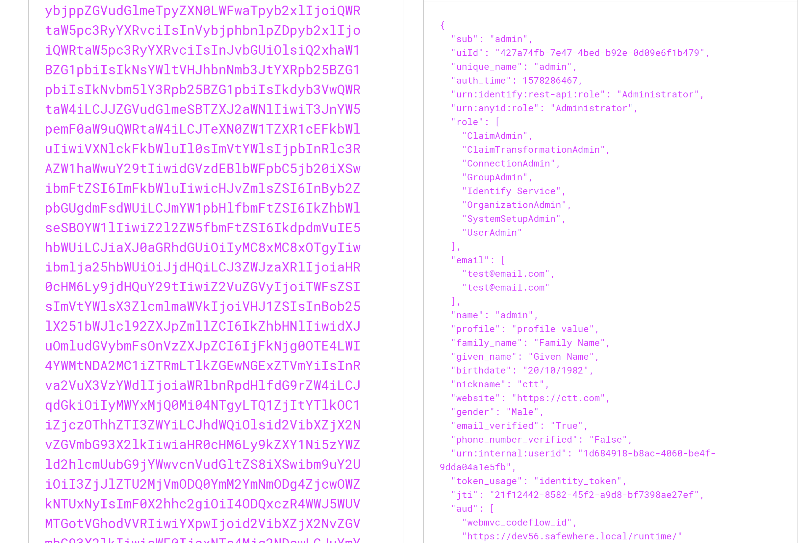


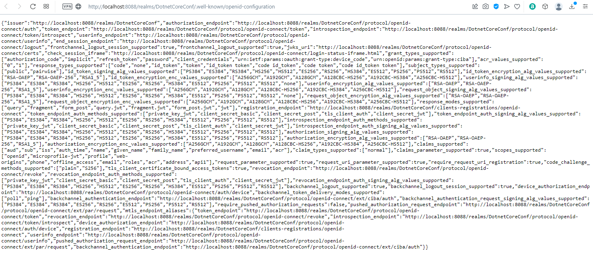

## Otros grants

## ¿Cómo hacemos para usar oAuth con interacción del usuario sino tenemos un navegador?

- Resource owner
- Device

# Referencias

- JWT.io
- https://docs.microsoft.com/en-us/azure/active-directory/develop/v2-oauth2-auth-code-flow
- [oAuth](https://oauth.net)
- Keycloack