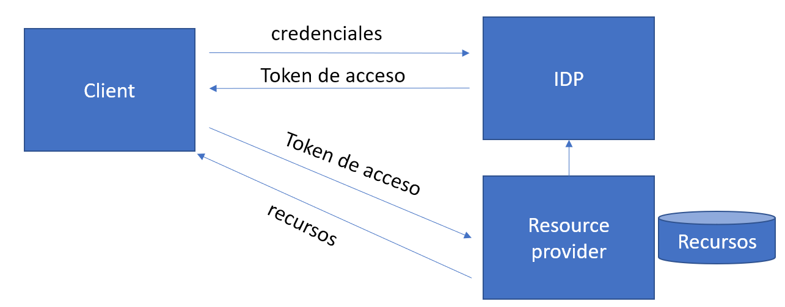
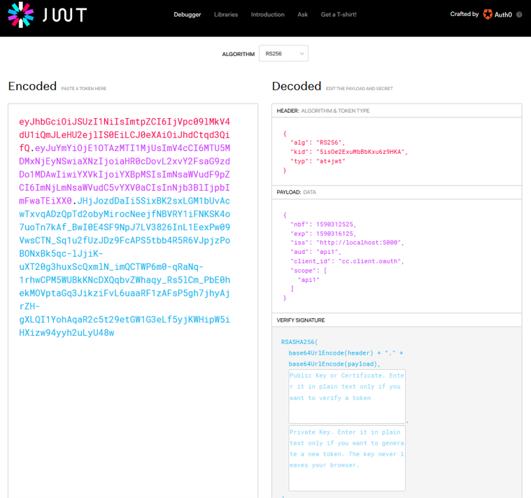
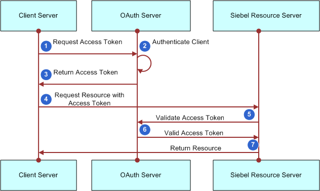
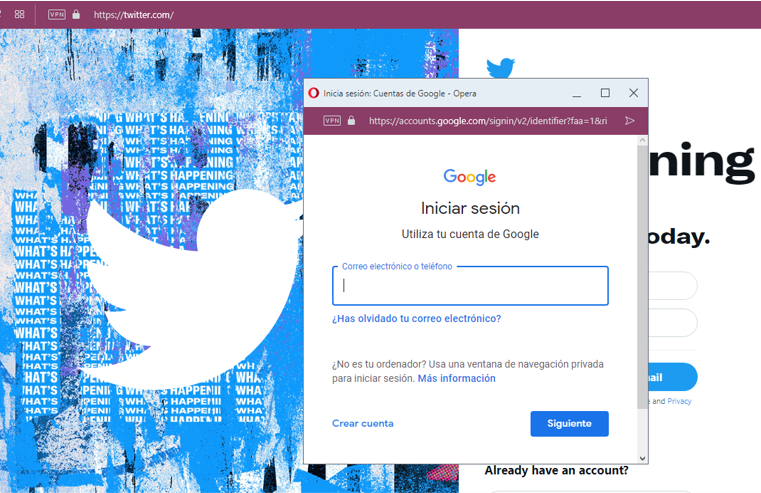
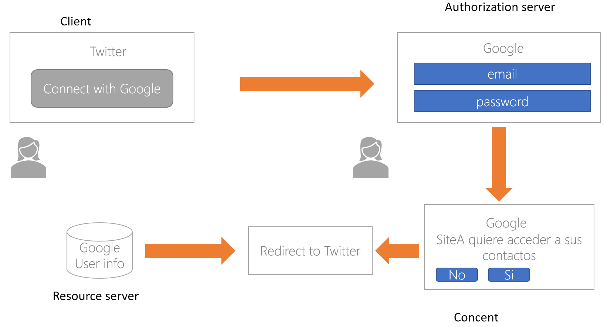
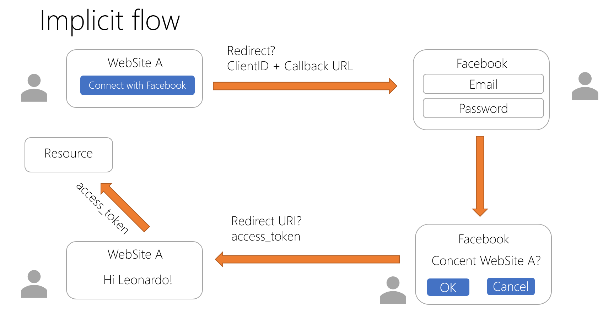

# Autorización, Tokens, Flujos, oAuth y OIDC para todo el mundo

# Leonardo Micheloni

@leomicheloni

## La necesidad

Existen muchos escenarios en los que necesitamos acceder a un recurso de un tercero desde nuestra aplicación.
Por ejemplo si estamos desarrollando una aplicación para gestionar la cuenta de Twitter de los usuarios necesitaremos acceso a la información de su cuenta, su timeline y hasta permisos para publicar en su nombre.
 También podemos tener la necesidad de crear una aplicación que simplemente busque los TT en Twitter y haga algo con eso.
 Otro ejemplo podría ser necesitar acceder a la información de Google maps, un conjunto de recursos de una plataforma de terceros, etc.
 O acceder los contactos de Gmail de una persona para invitarlos a participar de nuestra propia plataforma.

 En el pasado ha habido métodos para lograr esto los cuales han llegado a ser incluso proveer nuestro usuario y password de Gmail para que Yelp acceda a nuestra cuenta y recupere la información de nuestros contactos.

 ## El problema

El problema es encontrar un método para otorgar acceso a algún recurso propio a un tercero sin necesidad de otorgar nuestras credenciales.
Métodos de este tipo, no solo que comprometen nuestras credenciales sino que también dan acceso a todos los recusos que tenemos acceso, el tiempo que se otorga este acceso a ilimitado y, además, finalmente quien obtenga en acceso a fines prácticos actúa como si fuera nosotros mismos ya que tiene las credenciales.

El escenario ideal sería:
 - Otorgar acceso sin exponer nuestras credenciales
 - Que este acceso sea limitado a un grupo de recursos
 - Que el tiempo de duración de este acceso sea limitado
 - Que en caso de comprometerse ese método de acceso el daño sea el menor posible
 
 ## oAuth

 ### Introducción
 Es un protocolo standard de autorización que se encuentra muy extendido, principalmente su versión 2.0.
 

### Autorización vs autenticación
Autorización es la capacidad de acceder a un recurso, estar autorizado para acceder, es equivalente a poseer una entrada para un recital, no importa quién soy ni como la obtuve, si se comprueba que la entrada es válida y para el recitarl correcto, en la fecha, hora y lugar correctos el solo hecho de poseer esta entrada me permite obtener acceso, me autoriza.

Autenticación es la capacidad de verificar la identidad el sujeto, por ejemplo por medio de un pasaporte, en él figuran mis datos y se puede verificar quién soy ya que el documento indica datos propios.

oAuth es un protocolo de autorización.

## Autorización
--- 

## Autenticación
---

---

## Terminología

Para el mismo caso de Yelp queriendo acceder a nuestros contactos de Gmail vamos a cambiar un poco la terminología para que sea más parecida a la que utiliza oAuth

- Tiene acceso a todos mis recursos
- Por tiempo indefinido
- De hecho, para Yahoo es yo mismo

### Escenario deseado:

 - Otorgar acceso sin exponer nuestras credenciales
 - Que este acceso sea limitado a un grupo de recursos
 - Que el tiempo de duración de este acceso sea limitado
 - Que en caso de comprometerse ese método de acceso el daño sea el menor posible

---

---

---

### Esto es uno de los "flujos" o "grants" que oAuth ofrece para autorización.

## ¿Y Qué es un Token?

Es un trozo de información, en nuestro caso vamos a utilizar un formato conocido como JSON Web token o JWT

### JWT

- En un conjunto de información
- Es otorgado por el Auth Server
- Tiene 3 bloques: Header, Payload y Signature
- Tiene un vencimiento
- Indica los accesos (scopes)
- Pueden ser Self encoded
- Puede incluir un código para refrescar el vencimiento con un nuevo token (Refresh token es también un scope offline_access)
- Es firmado con clave asimétrica

## ¿Y qué es un grant o flow?

Es el flujo de intercambios de mensajes entre el Authorization Server y el Client para obtener un Access Token

- Client Credentials: Para robots
- Implicit: Con redirección, interactivo
- Code / Code + PKCE
- Resource owner
- Device
- Hybrid

## Terminología

- Client: Quien quiere acceder al recurso
- Resource:
- Token: 
- Grant: Flujo para obtener el token de acceso
- Authorization Server
- Resource Server

## Client Credentials grant

- Solo para robots (el usuario no interviene)
- **Solo por backchannel** (el secret queda expuesto)
- Muy común para acceso entre APIs 
-Es conveniente utilizar solo los scopes necesarios

>      ---

## Ejemplo client credential ##

>      ---

## Flujos con participación del usuario (front channel)

---

Esto también es trasladable a nuestra aplicación.

---

### Características de implicit flow

- Es interactivo
- Es posible que el usuario tenga que indicar el concentimiento
- Se realiza por front channel

### Desventajas

- Solo para SPA (y si no tienen back)
- Interactivo
- El token queda almacenado en el client
- El callbackURL es un dato clave
- El token no se puede refrescar
- No es recomendable

>      ---

## Ejemplo Implicit ##

>      ---

## Solicionando los problemas de Implicit Flow (Authorization Code Flow grant)

- Necesitamos sí o sí de un backchannel (backend)
- Permite refresco 
- Podemos solicitar un token de corta duración ya que es posible refrescar
- Es más complejo
- Es el método recomendado

- El authorization server nos entrega un código de uso único
- De tiempo limitado
- Solo para el cliente que lo solicitó
- Solo para los scopes solicitados
- Con eso code solicito el access_token 
- Puedo hacer refresh a partir de ahí desde backchannel

## ¿Cómo hacemos para usar oAuth con interacción del usuario sino tenemos un navegador?

# Referencias

- JWT.io
- https://docs.microsoft.com/en-us/azure/active-directory/develop/v2-oauth2-auth-code-flow
- oAuth
- Keycloack